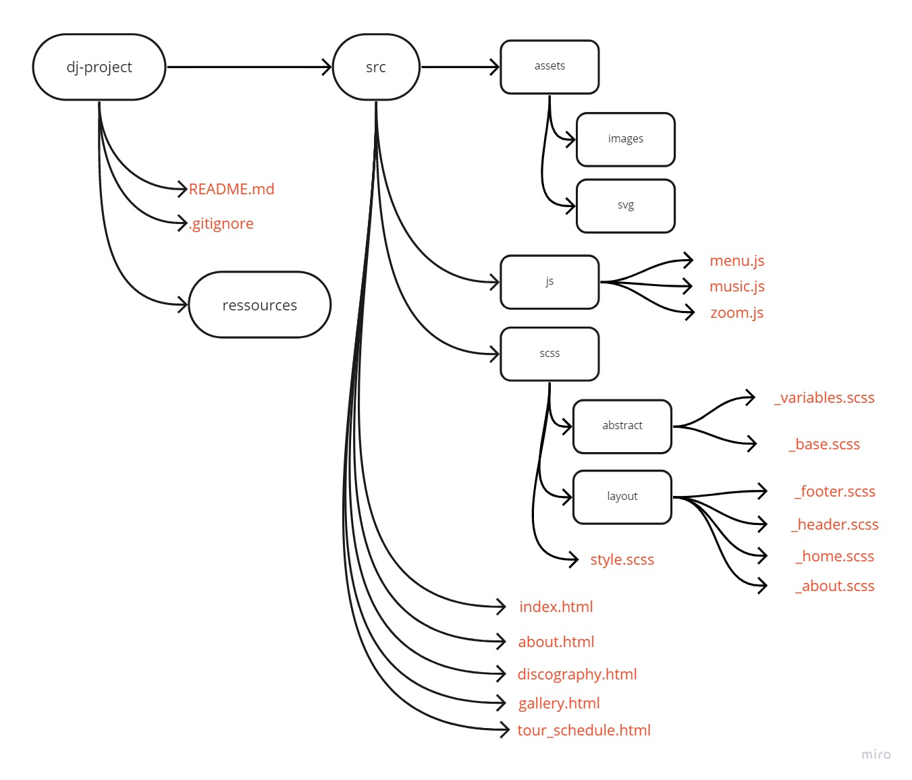

# Project DJ - Mr Oizo

The purpose of this website is to inform it's future visitors about the DJ's new releases and events. In the future he wants to open a ticket shop. 

You can checkout the roadmap [here](https://github.com/MrSociety404/dj-project/projects/1)

## Table of contents
- [Final project](#finale-project)
- [Dependencies](#ependencies)
- [Prototype](#prototype)
- [Contributors](#contributors)

## Final project

You can checkout the final project [here]()

## Dependencies
- Semantic HTML5 markup
- CSS 
- Mobile-first workflow
- [Sass](https://sass-lang.com/)
- [Parcel](https://parceljs.org/)

## Prototype

## Contributors
- Fabrice Cst [Github](https://github.com/MrSociety404)
- Michael Tesfay [Github](https://github.com/Mika215)
- Meulemans Philippe [Github](https://github.com/Laverdure77)